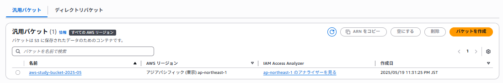
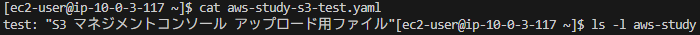
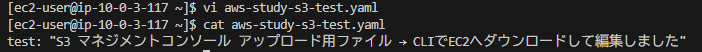
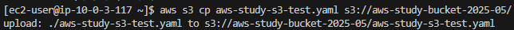
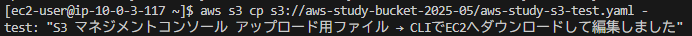
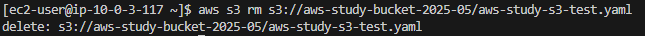
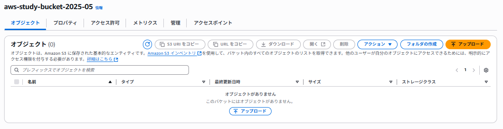

# lecture30

## 1. S3バケットの作成（コンソール）

## 2. EC2 への AWS CLIの設定

## 3. CLIによるファイル操作

### S3からダウンロードしたファイル確認（EC2）

### 編集（EC2）

### アップロード（EC2 → S3）

### アップロードファイル確認（S3）

### 削除（S3）

## 4. 削除反映確認（コンソール）

